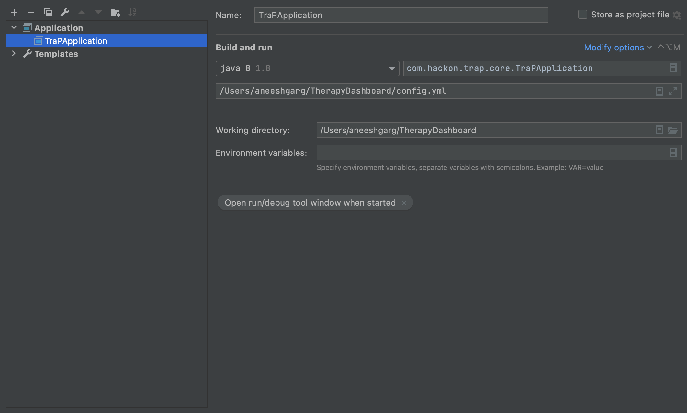

# Therapy-Dashboard

# Setup

1. Start the MySQL docker container 
    Go to `docker_local` directory and run the command 
    `docker-compose -f docker-compose.yml up -d`
    
    Confirm that docket image `td_mysql` is up by using the command `docker ps -a`
    
2. Currently, migration is not supported for the application. The queries in 
   
   `/Therapy-Dashboard/src/main/resources/migration/v001__init.sql` file will have to be run manually on the mysql server manually.
   
   `$ docker exec -it td_mysql bash`
   `$ mysql -u root -p`
   password `root`
   
   Use the db `services` and run the queries in above mentioned file
   
3. Open the project in an ide an load all the maven dependencies

4. Run the server with following configuration

5. Clone the front-end git repo `https://github.com/deeox/theraplanner` and run the commands:
   
   `$ npm install`
   
   `$ Node app.js`
